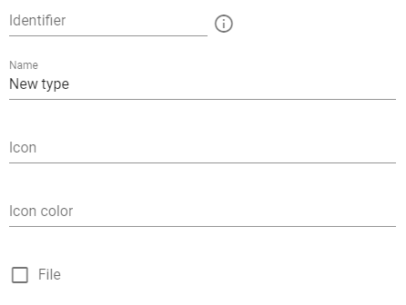

# Data Model

[[toc]]

## What is data model?

Different businesses and companies have different needs in product data. Someone needs to store only basic data, another has to store addition information like logistic,
certifications (for food, for example), etc.

As a result, it is impossible to create a system that will be ready to store all possible types of information without any configuration.
Instead, we give you the ability to customize the system for your specific needs, define yourself what information and how you need to store it.

So, `Data Model` describes what information to store and how to store it.

## Types

The first important aspect of a `Data Model` are `Types`. Types define what kind of entities or objects you have in your system.
For example, your product hierarchy can consist of 2 levels of hierarchy and then there are products:

 

To do this, you need to set 3 types, 2 types that will reflect 2 levels of the hierarchy and one type for the product itself:

 

`Type` is some kind of container that can later contain attributes and the type has its own parent (another type).
This type can only be created from another specific parent type. You cannot create an item in this configuration and attach it to the first level of the hierarchy (but this can be done if you change the data model).

A type can represent both a product and a hierarchy and, for example, the store where your products are located (if you need to store this information too), etc.
So, you can put any information that you want into the system.

**A type is some object with a group of attributes that you want to store in the system**.

After defining types, the user will already be able to create objects (products, classifications, etc.) of these types. **type is some template by which objects will be created**. For example, you can have a type `Product` and you can enter, for example, 1000 objects of type `Product`.

### Editing types

You can create, change or delete a type by going to the system settings and selecting the `Types` menu:

 

You will need to enter the following settings to create a type:

 

- `Identifier` is the text by which you can refer to this type in the future, it must be in English and must not contain spaces.

- `Name` - type name

- An `icon` is a icon that will be displayed with the system along with this type. This is the name of the icon from [this list](https://materialdesignicons.com/)

- `Icon color` is the color for the icon. You can choose the name of the color from [this list](https://vuetifyjs.com/en/styles/colors/)

- `File` is an indication that this type is a file. If you choose it, the system will allow you to upload files to objects of that type

## Attributes

After you create the types, you need to define what attributes each type will have. For example, for a product you need to store the manufacturer, its dimensions and weight, name, etc. But, for example, a classification may not contain any attributes.

### Attribute groups

Attributes are grouped. To create or change an attribute group, you need to go to system settings and select the menu `Attributes`

 

The following fields will be available to4you:

 

- `Identifier` is the text by which you can refer to this group in the future, it must be in English and must not contain spaces

- `Name` - group name

- `Order` - it determines in what order the group will be shown on the screen in relation to other groups.

- `Visible` - the attribute group may not be visible, in which case it is used to restrict access. You can read more about this in the [User Management] section.(./04_UserManagement.md)

### Dependence of attributes on the position of the product in the hierarchy

As we already mentioned, a type can have various attributes. But imagine that we have entered a lot of products into the system, all of them are of the same type - "Product". But products can have both common attributes (for example, `Name`) or different (for example, `Diagonal size`, which is very important for TVs, but is meaningless for headphones). 

Therefore, we need to be able to set not only what type the attribute belongs to, but also at what level it is displayed.

For example, we have the following hierarchy:

 

Products in `118-KL1 Series` hierarchy has attribute `Calculated attribute`, but products in other hierarchies does not has it.
So, to define such data model we can create the following configuration for `Calculated attribute` attribute:

 

This means that we create an attribute `Calculated attribute` for the `Item` type, but this attribute will be visible only for the category `118-KL1 Series`

Thus, you can very flexibly configure which attributes exists and how to store them.

### Editing Attributes

After you have created an attribute group, you can create attributes in it. The following settings will be available to you:

 

- `Identifier` is the text by which you can refer to this attribute in the future, it must be in English and must not contain spaces

- `Language dependent` - If this option is enabled, then for each language in the system you can set a separate value for this attribute. For example, the product name will be different for different languages

- The `attribute type` is the type of data that you can store in this attribute. The following data types are available: Text, Boolean, Integer, Float, Date, Time and [List of Values](./01_DataModel.html#list-of-values)

- `Regex pattern` - [Regex](https://en.wikipedia.org/wiki/Regular_expression) allows you to set an additional check for the data, for example, determine that your integer attribute must be at least 3 characters long (this is defined as `^[0-9]{3,}$`)

- `Error message at regex validation` - this is the text that will be shown to the user if the Regex check fails

- `Order` - it determines in which order the attribute will be displayed in relation to the other attributes in that group

Additionally, for attributes of type `Text` you have the following settings:

- `Multi line` - this option means that the text will be shown not as a single field, but as a text field in several lines (this is necessary if you want to store long text)

- `Rich text` - this means that your text will not be just text, but formatted text, where you can set the size, font color, etc.

## Relations

You already know how to set the types in the system and how to determine what attributes these types will have. But besides this, you may need to link objects to each other through relations.

As we defined, we have a product hierarchy tree with 2 hierarchy levels and the product itself, but often the product hierarchy tree does not correspond to other hierarchies. 
For example, on your website the catalog structure can be different, or, you upload products to the marketplace, where the product structure is defined and you cannot change it.
So your products are in one place in your catalog and in another in the marketplace. But our type system defines only one parent type from which a product can be created.

For example, we have products in our catalog but we also want to link them to [ETIM](https://www.etim-international.com/) hierarchy. We should create new types that will store information about ETIM to resolve this:

 

Then we can load necessary ETIM classifications into our system:

 

We can not create an item under ETIM classification because it is already has parent in our main hierarchy.
But we can create `Relation` between item and ETIM:

 

We defined that we have a link between type `Classification Level 2` and `Item`. Loaded ETIM hierarchies has type `Classification Level 2` and now we can link each product (type `Item`) with ETIM.

 

Also, relations can be used for any logical links between objects in the system.

For example, you can store price data separately from products (if this is necessary by your data model) and link prices with specific products through relations.

### Editing relations

You can create, change or delete a relation by going to the system settings and selecting the `Relations` menu

 

The following settings will be available to you:

 

- `Identifier` is the text by which you can refer to this relation in the future, it must be in English and must not contain spaces

- `Name` - relation name

- `Visible as child` - determines whether dependent objects will appear as children in the main hierarchy, or whether they will be available only when viewing the details of an object

- `Can be more than one` - allows or denies having multiple dependencies of this relation type for one source object

- `Sources` - list of types who can be sources of this relation

- `Targets` - list of types who can be targets of this relation

## List of values

Sometimes it is convenient to have the attribute values selected from a well-defined list rather than typing it into a text box. For example, if the color of your products can be from limited list of colors, then it is convenient to have this list of colors and select a value from it.

For this, the system has `List of values`. You can set values for your attribute:

and you will have access to values from this list when entering data:

### Editing list of values

You can create, modify or delete a list of values by going to system settings and selecting the menu `Lists of values`

The following settings will be available to you:

 

- `Identifier` is the text by which you can refer to this list of values in the future, it must be in English and must not contain spaces

- `Name` - list of values name

also, you will be able to define necessary values

