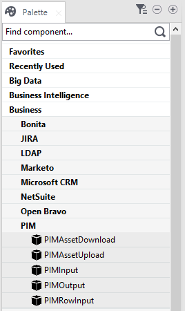
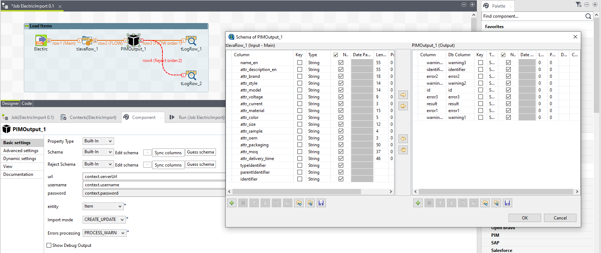
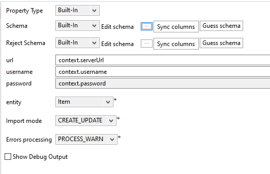
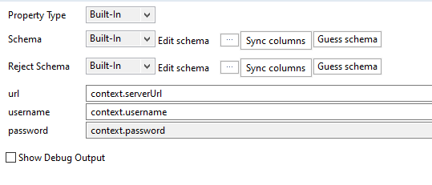
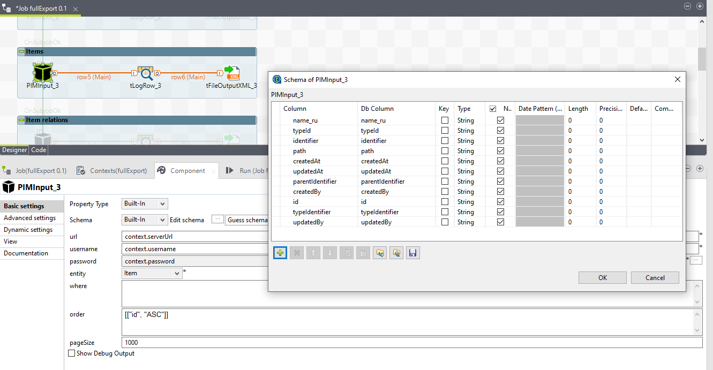
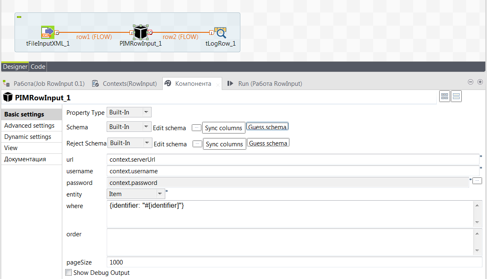
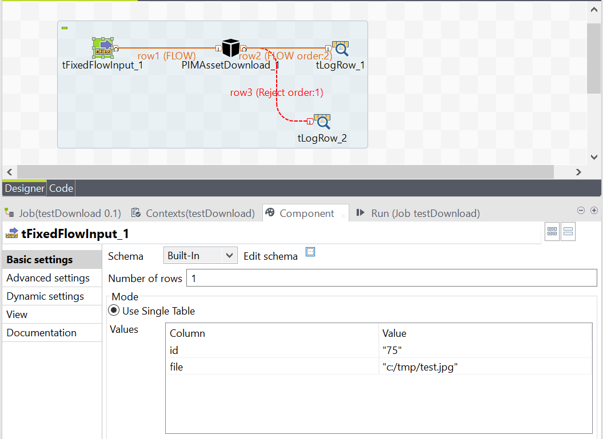
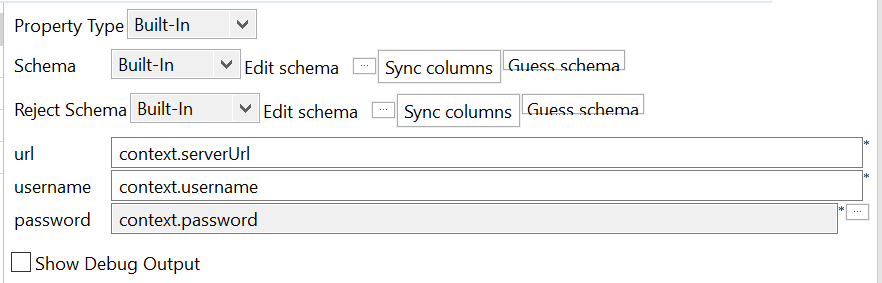

# Import/Export

[[toc]]

## Introduction

Import of data is very important for PIM systems, because it is impossible to enter manually a lot of data in a short period of time, and usually such systems are used in companies when the number of product names reaches a thousand or more. Therefore, initially it is necessary to import a lot of data into the system.
Even then, imports can be used on a daily basis to download live data from other systems in the company like [ERP](https://en.wikipedia.org/wiki/Enterprise_resource_planning), etc.

Export is also often used on a daily basis, since the information about products that were enriched in the system must go to other systems, for example, to a website, a marketplace, etc. This is the main point of PIM systems to manage all product information in one place and then distribute the collected and verified information further.

Also, it is often impossible to predict in what format and with what transformations the data must be exported, so the capabilities of the import and export system should be very flexible and customizable.

To solve this problem, we propose to use a product that has proven itself over the years in various companies and which is completely free - [Talend Open Studio](https://www.talend.com/products/talend-open-studio/).

This is [ETL tool](https://en.wikipedia.org/wiki/Extract,_transform,_load), which allows you to extract data from various sources, transform it and then output it in various forms and formats.

We created an integration with this tool so that it would be possible to upload and download data to and from the system using it. This allows you to use the full power of Talend to transform the received data. As a result, you can import and export data from/to any files (CSV, XML, Text, etc.) and also from/to any databases.

You can learn more about this tool from this [tutorial](https://www.talend.com/resources/discovering-talend-studio/).

## Installation of OpenPIM integration into Talend

1. First you need to install Talend Open Studio itself and Java (required for Talend to work).

2. Then you need to download the components for integrating our system and Talend: [pim-components.car](https://www.openpim.org/talend/pim-components.car).

3. Finally, you need to run the command:

```powershell
java -jar pim-components.car studio-deploy <DIRECTORY WHERE Talend IS INSTALLED>
```

This will install our components and they will appear in the palette of available components in Talend:




## Import

We provide 2 components for importing data into the system:

- PIMOutput - to import data about products and their dependencies
- PIMAssetUpload - to import files

### PIMOutput

PIMOutput is used to import data about products and their dependencies into the system. It also supports importing the data model itself, that is, objects such as types, attributes, dependencies, etc.

To import data, you need to call this component and pass it a data set in the form of columns with appropriate names. Each column name reflects in which attribute the data will be written.



The following columns are supported for items:

- `identifier` - Item identifier (must be in English and must not contain spaces)
- `typeIdentifier` - Type identifier. An object of this type will be created.
- `parentIdentifier` - The identifier of the parent object. A new object will be created under this parent, or an object will be created at first level if this column is not specified.

This set of columns is the minimum required to create a new item.

The following columns are also available:

- `name_<language identifier>` - This is the name of the item. You can have multiple columns such as `name_ru`,` name_en`, etc. for different languages.
- `attr_<attribute identifier>` or `attr_<attribute identifier>_<language identifier>` - the value of a particular attribute. You need to set the attribute identifier so that the data is written to it. If this attribute depends on the language, then you additionally need to specify the identifier of the language in which you want to record the data. For example, if you have a `description` attribute and it is language dependent, then you need to have a column named `attr_description_ru` to write data to it.

The following columns are supported for relations between items:

- `identifier` - relation instance identifier (must be in English and must not contain spaces)
- `relationIdentifier` - Relation type identifier. A relation of this type will be created.
- `itemIdentifier` - Identifer of source item.
- `targetIdentifier` - Identifer of target item.

This set of columns is the minimum required to create a new relation.

The following columns are also available:

- `attr_<attribute identifier>` or `attr_<attribute identifier>_<language identifier>` - the value of a particular attribute. You need to set the attribute identifier so that the data is written to it. If this attribute depends on the language, then you additionally need to specify the identifier of the language in which you want to record the data. For example, if you have a `description` attribute and it is language dependent, then you need to have a column named `attr_description_ru` to write data to it.


To configure the component itself, you need to specify:



- `url` - server url
- `username` - username
- `password` - password of user
- `entity` - Where to import data, the following options are available: Item, Item Relation (relation instance), Type, Attribute, Atribute Group, Relation, User, Role, List of values
- `Import mode` - import operation mode: CREATE_UPDATE - if an object with this identifier is found, then it will be updated, otherwise it will be created, CREATE_ONLY - if an object with this identifier is found, an error will occur, otherwise it will be created, UPDATE_ONLY - if an object with this identifier is found, it will be updated otherwise an error will occur
- `Errors processing` - how to respond to errors: PROCESS_WARN - arising warnings will not stop import and the object will be created or updated, WARN_REJECTED - in case of warnings, the object will not be changed
- `Show debug output` - If this option is selected, the system will display additional debug information during import

::: tip
This component has 2 outputs. If the record is processed normally, it will go to the main output, otherwise it will go to the reject output. This way you can filter out all erroneous entries.
:::

### PIMAssetUpload

PIMAssetUpload is used to import files to the system.

***Important:*** PIMAssetUpload can load a file only into an existing item, that is, you must first create an item, manually or via [PIMOutput](./02_ImportExport.md#pimoutput) and only then load the file into it.

PIMAssetUpload requires 2 columns as input:

- `id` - internal item id, this is not Identifier, it is possible to see this id in system UI or receive through [PIMInput](./02_ImportExport.md#piminput) or [PIMRowInput](./02_ImportExport.md#pimrowinput)
- `file` - full path to the file that will be imported

To configure the component itself, you need to specify:



- `url` - server url
- `username` - username
- `password` - password of user
- `Show debug output` - If this option is selected, the system will display additional debug information during import

::: tip
This component has 2 outputs. If the record is processed normally, it will go to the main output, otherwise it will go to the reject output. This way you can filter out all erroneous entries.
:::


## Export

We provide 3 components for exporting data from the system:

- PIMInput - to export data about items and their relations
- PIMRowInput - this component is similar to PIMInput but has advanced data fetching capabilities
- PIMAssetDownload - to export files

### PIMInput

PIMInput allows you to select objects according to a given criterion and export them from the system. Both items and their relations and data model export are supported.



The component has the following options:

- `url` - server url
- `username` - username
- `password` - password of user
- `entity` - what data to export: Item, Item Relation, Type, Attribute, Atribute Group, Relation, User, Role, List of values
- `where` - what kind of data you want to export. The request format is described in the ["Query Language"](./06_Appendix.html#query-language) section. 
- `order` - here you can define what columns to use to order data
- `page size` - how many records to receive for one request to the server. This can affect export performance if you are unloading
a lot of data, then a small value of this parameter will lead to an increase in the number of requests and, accordingly, to a longer runtime
- `Show debug output` - If this option is selected, the system will display additional debug information during export

This component requests data and displays it in the appropriate columns. The following columns are supported for items:

- `identifier` - item identifier
- `id` - item internal id (number)
- `typeIdentifier` - item type identifier
- `typeId` - item type internal id
- `parentIdentifier` - identifier of parent item 
- `name_<language identifier>` - name of the item. You can have multiple columns such as `name_ru`,` name_en`, etc. for different languages.
- `attr_<attribute identifier>` or `attr_<attribute identifier>_<language identifier>` - the value of a particular attribute. If attribute
depends on the language, then each language will have its own value (column). For example, if you have a `description` attribute and it depends on the language, then you will have columns with the name `attr_description_ru` and `attr_description_en` for Russian and English, respectively
- `createdAt` - item creation time
- `createdBy` - user who created item
- `updatedAt` - item last modification time
- `updatedBy` - user who last modified item


The following columns are supported for item relations:

- `identifier` - item relation identifier
- `id` - item relation internal id
- `relationIdentifier` - relation type identifier
- `relationId` - relation type internal id
- `itemIdentifier` - source item identifier
- `itemId` - source item internal id
- `targetIdentifier` - target item identifier
- `targetId` - target item internal id
- `attr_<attribute identifier>` or `attr_<attribute identifier>_<language identifier>` - the value of a particular attribute. If attribute
depends on the language, then each language will have its own value (column). For example, if you have a `description` attribute and it depends on the language, then you will have columns with the name `attr_description_ru` and `attr_description_en` for Russian and English, respectively
- `createdAt` - relation creation time
- `createdBy` - user who created relation
- `updatedAt` - relation last modification time
- `updatedBy` - user who last modified relation


### PIMRowInput

PIMInput is the start component, that is, it must be at the beginning of the Job in Talend. But, what if you have, for example, a list of product IDs in a file and you want to export only them and not export other records? In this case, you cannot use PIMInput since you cannot write a query in it that will filter the items by your list.

For this task you need to use PIMRowInput. It is very similar to PIMInput, but it is not a start component and does not have to be the first. At the same time, he still knows how to take values from the incoming columns in order to form the required query.



In this case, we read the list of identifiers from the file into the `identifier` column (this happens in tFileInputXML_1), then we call
PIMRowInput and make a request `{identifier:"#[identifier]"}`. This means that you need to find an object with the identifier `#[identifier]`. But since we are using PIMRowInput, it transforms this request. For each record that we read from the file, it calls a request to the system and instead of `#[identifier]` the real value from the `identifier` column is substituted. For example, if we have 2 identifiers in the file: `111` and` 222`, then the following requests will be sent to the system:

1. `{identifier: "111"}`
2. `{identifier: "222"}`

So, PIMRowInput replaces `#[<column name>]` with the actual value in that column. As a result, we can make requests that depend on the transmitted data. This cannot be done with just PIMInput.

All other options for this component are similar to the PIMInput component.

### PIMAssetDownload

This component is used to export files from the system.




It requires 2 columns: `id` and `file`. For each incoming record, it will find an object by the given internal identifier `id`
and is written to the file at the path specified in the `file` column.

The component has the following options:




- `url` - server url
- `username` - username
- `password` - password of user
- `Show debug output` - If this option is selected, the system will display additional debug information during export

This component has 2 outputs. If the file is unloaded normally, it will go to the main exit, otherwise it will go to an reject exit. This way you can filter out all erroneous entries.
