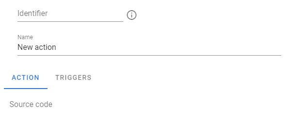
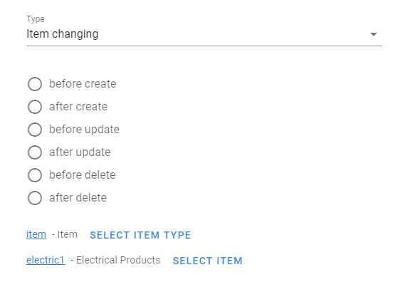
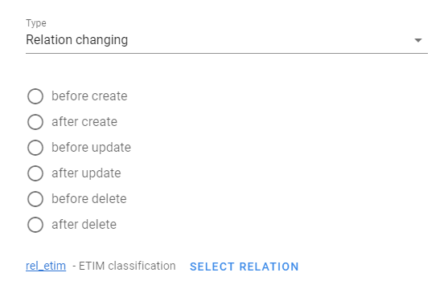
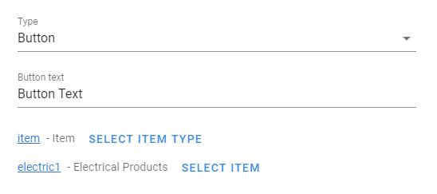
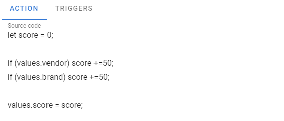

# Actions

[[toc]]

Actions allow you to define additional logic that will be executed when items or their relations are created or modified.

Creating actions requires programming skills, as actions are written in Javacript.

## Editing actions

You can create, change or delete an action by going to the system settings and selecting the `Actions` menu

The following settings will be available to you:

 

- `Identificator` - the text by which you can refer to this action in the future, it must be in English and must not contain spaces.

- `Name` - action name.

- `Source code` - Javascript code that will be executed

The action is triggered by some event called a trigger. The system supports the following events:

1. Modifying or creating an item

 

You need to choose when the action will be called and for which item.

2. Modifying or creating relations between items

 

You need to choose when the action will be called and for what type of relations.

3. At the button click. The system will show an additional button in the object interface and the action will be called if the user clicks on it.

 

You need to choose the name of the button and for which object to show it.

## Action source code

You can write any logic in action, for example:

 

The following objects are available to you within your code:

- `item` - This is a javascript object that represents the current state of the system object, it has the following properties:
    - `item.identifier` - item identifier
    - `item.id` - item internal id
    - `item.typeIdentifier` - item type identifier
    - `item.typeId` - item type internal id
    - `item.parentIdentifier` - item parent identifier
    - `item.name` - This is the name of the object. Each language has its own name: item.name.en - for English, item.name.ru - for Russian, etc.
    - `item.createdAt` - item creation time
    - `item.createdBy` - who created the item
    - `item.updatedAt` - time of the last modification of the item
    - `item.updatedBy` - who last modified the item
    - `item.values` - the current values of the object's attributes. The value of each attribute is stored in the named property as the attribute identifier. That is, if we have a `color` attribute, then its value will be in` item.values.color`

- `values` - new values of the object's attributes. The value of each attribute is stored in the named property as the attribute identifier. That is, if we have a `color` attribute, then its value will be in` values.color`
- `models.item` - a javascript object that lets you work with the database for objects
- `models.itemRelation` - a javascript object that allows you to work with the database for dependencies
- `isImport` - ***true*** if the change occurs when importing data, ***false*** if the change occurs through system UI
