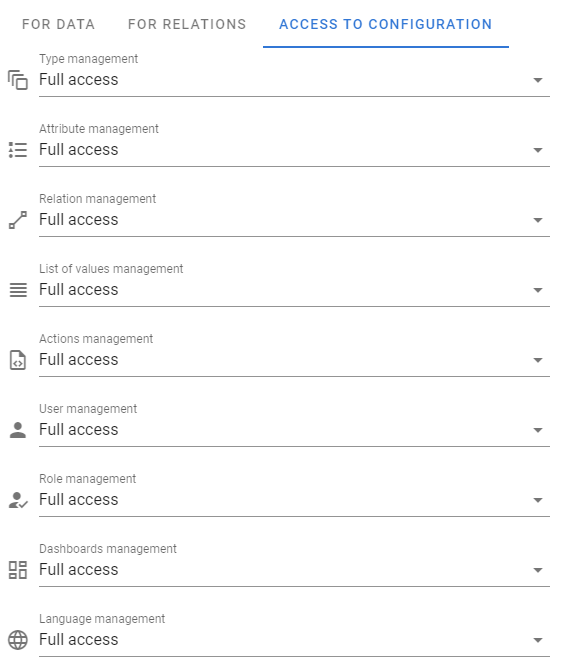
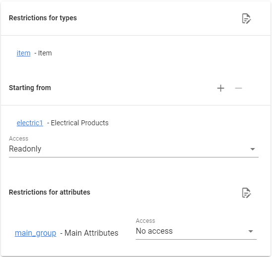
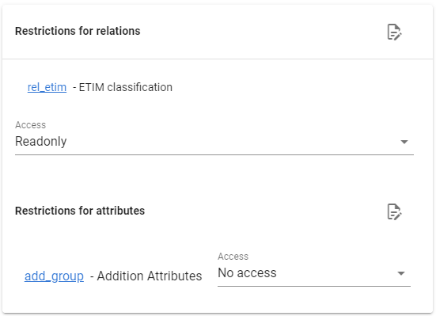
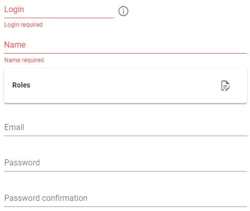

# User Management

[[toc]]

## Roles

User access to data or to the desired functionality is organized through `Roles`.

A role is a list of what is prohibited or allowed to do. A user can have several roles, then his access is determined by the totality of access of all these roles.

### Editing roles

You can create, change or delete a role by going to system settings and selecting the `Roles` menu.

For each role, you need to enter the following options:

- `Identifier` - the text by which you can refer to this role in the future, it must be in English and must not contain spaces

- `Name` - role name

Role access is determined by three components:

### Access to settings

You can specify what access this role has for each setting option. You have 3 access levels available:

1. No access
2. Read only
3. Full access

 

### Access to items

You can define what access restrictions a role has for given items. You also have 3 levels available: `No access`, `Read-only` and `Full access`.

Moreover, you can even define access to a specific group of attributes (also 3 levels).

 

### Access to relations

You can define what access restrictions the role has for the given relation types. You also have 3 levels available: `No access`, `Read-only` and `Full access`.

Moreover, you can even define access to a specific group of attributes (also 3 levels).

 

## Users

Once you have defined the roles that users can have, you can enter the system users themselves.

You can create, change or delete a user by going to the system settings and selecting the `Users` menu

Вам будут доступны следующие настройки:

 

- `Login` -  user login
- `Name` - user name
- `Roles` - list of user roles
- `Email` - email (if necessary)
- `Password` - user password
- `Password confirmation` - password confirmation

