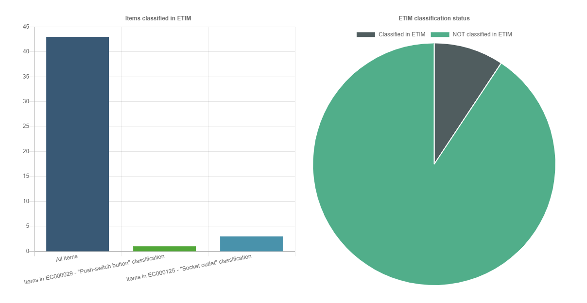
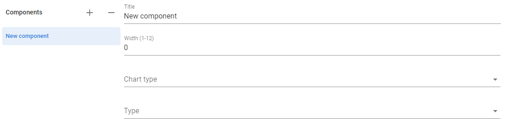
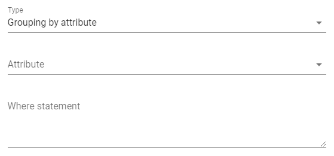
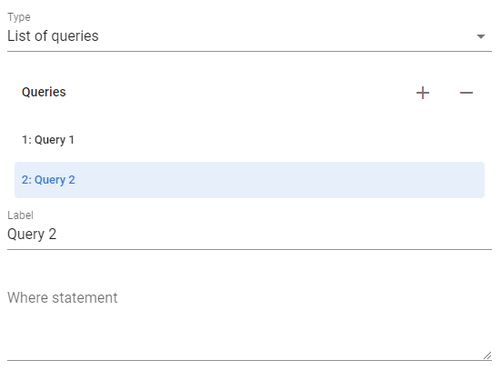

# Dashboards

[[toc]]

A dashboard is a set of graphs that show analytical data on a system.

## Dashboard editing

You can create, change or delete a dashboard by going to the system settings and selecting the `Dashboards` menu

The following settings will be available to you:

- `Identifier` - this is the text by which you can later refer to this dashboard, it must be in English and must not contain spaces
- `Name` - dashboard name
- `For these users only` - a comma separated list of usernames to show this dashboard. It will be shown to all users if this field is empty.

## Editing charts

Each chart in the dashboard is a component.

The following options will be available to you:

- `Name` - this title will be shown as the title of the chart
- `Width` - this is the width of the chart (a number from 1 to 12). If you want to arrange 2 charts in one line so that each takes up half of the screen, then set the width to 6 for each of the components
- `Chart type` - this is the type of chart you have available: bar chart, horizontal bar chart, donut chart and pie chart
- `Type` - this is the type of how the data will be displayed on the chart

## Grouping By Attribute Component Type

This type executes one query to the system and groups data by the selected attribute, as a result, you are shown a diagram for this selection.

You need to select the attribute by which to group. You can also specify an additional filter on which records to carry out this grouping in the `Where` field. This request is written in ["Query Language"](./06_Appendix.html#query-language) 

## Query List Component Type

In this case, you need to specify a list of queries (in ["Query Language"](./06_Appendix.html#query-language)) and the chart will display data according to this list.

