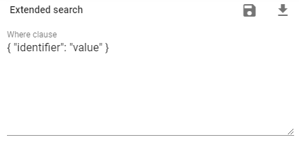

# Appendix

[[toc]]

## Query Language

Queries are used in the following places:

1. During export in components [PIMInput](./02_ImportExport.md#piminput) and
[PIMRowInput](./02_ImportExport.md#pimrowinput)

2.When creating [dashboards](./05_Dashboards.md#grouping-by-attribute-component-type)

3. With extended search in the system



Query is text in [JSON](https://www.json.org/) format

### Basic syntax

``` json
{"identifier": "product1"}
```

This means that you will find items whose identifier is `product1`. The following fields are available to you:

- `identifier` - item identifier
- `id` - item internal id
- `typeIdentifier` - item type identifier
- `typeId` - item type internal id
- `parentIdentifier` - parent item identifier
- `name` - iten name. Each language has its own name: name.en - for English, name.ru - for Russian, etc.
- `createdAt` - item creation time
- `createdBy` - who created the item
- `updatedAt` - time of the last modification of the item
- `updatedBy` - who last modified the item
- `values` - the current values of the items's attributes. The value of each attribute is stored in the named property as the attribute identifier. That is, if we have a `color` attribute, then its value will be in `values.color`. If this attribute also depends on the language, then each language will have its own value `values.color.ru`,` values.color.en`, etc.

query for compound fields like `name.ru`, `values.color`, etc. looks like that:

``` json
{"name": { "en" : "product name"} }
```
 
 example for an attribute value that depends on the language (attribute identifier is `description`)

``` json
{"values": { "description" : { "en" : "product description"} } }
```

***Important:*** The query language has the concept of an operator. in the examples above, it is not present, so the equal operator (`OP_eq`) is assumed. Therefore, these same requests can be expressed as follows:

``` json
{"identifier": {"OP_eq": "product1"} } // identifier = "product1"
```

``` json
{"name": { "ru" : {"OP_eq": "product name"} } } // name.ru = "product name"
```
 
``` json
{"values": { "description" : { "ru" : {"OP_eq": "product description"} } } } // values.description.ru = "product description"
```

Several conditions can be set:

``` json
{
    "identifier": "product1",
    "typeIdentifier": "item"
}
```

In this case, the logical operator "AND" (`OP_and`) is also automatically used. This query can be rewritten as:
``` json
{
    "OP_and": [
        { "identifier": "product1" },
        { "typeIdentifier": "item" }
    ]
}
```

You can use the logical OR operator (`OP_or`) in the same way
``` json
{
    "OP_or": [
        { "identifier": "product1" },
        { "typeIdentifier": "item" }
    ]
}
```

All objects with identifier equal to "product1" OR type identifier equal to "item" will be selected


### Operators

The following operators are available to you:

- `OP_eq: 3` = 3
- `OP_ne: 20` != 20
- `OP_is: null` IS NULL
- `OP_not: true` IS NOT TRUE
- `OP_or: [5, 6]` (someAttribute = 5) OR (someAttribute = 6)

Comparison Operators

- `OP_gt: 6` > 6
- `OP_gte: 6` >= 6
- `OP_lt: 10` < 10
- `OP_lte: 10` <= 10
- `OP_between: [6, 10]` BETWEEN 6 AND 10
- `OP_notBetween: [11, 15]` NOT BETWEEN 11 AND 15

Other operators

- `OP_in: [1, 2]` IN [1, 2]
- `OP_notIn: [1, 2]` NOT IN [1, 2]
- `OP_like: '%hat'` LIKE '%hat'
- `OP_notLike: '%hat'` NOT LIKE '%hat'
- `OP_startsWith: 'hat'` LIKE 'hat%'
- `OP_endsWith: 'hat'` LIKE '%hat'
- `OP_substring: 'hat'` LIKE '%hat%'
- `OP_iLike: '%hat'` ILIKE '%hat' (case insensitive)
- `OP_notILike: '%hat'` NOT ILIKE '%hat'
- `OP_regexp: '^[h|a|t]'` REGEXP/~ '^[h|a|t]'
- `OP_notRegexp: '^[h|a|t]'` NOT REGEXP/!~ '^[h|a|t]' 
- `OP_iRegexp: '^[h|a|t]'` ~* '^[h|a|t]'
- `OP_notIRegexp: '^[h|a|t]'` !~* '^[h|a|t]' 

### Logical combinations

Operators `OP_and`, ` OP_or` and `OP_not` can be used to specify complex queries

