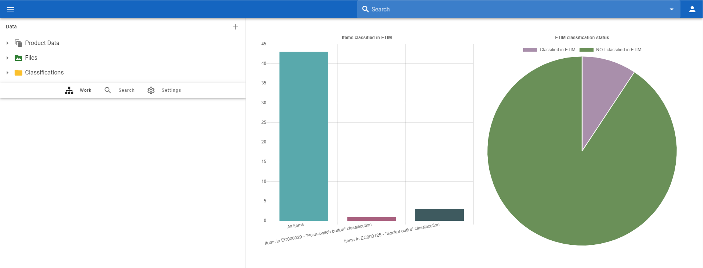
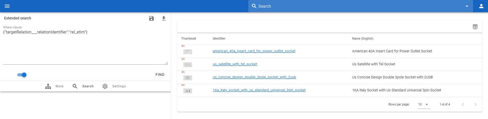
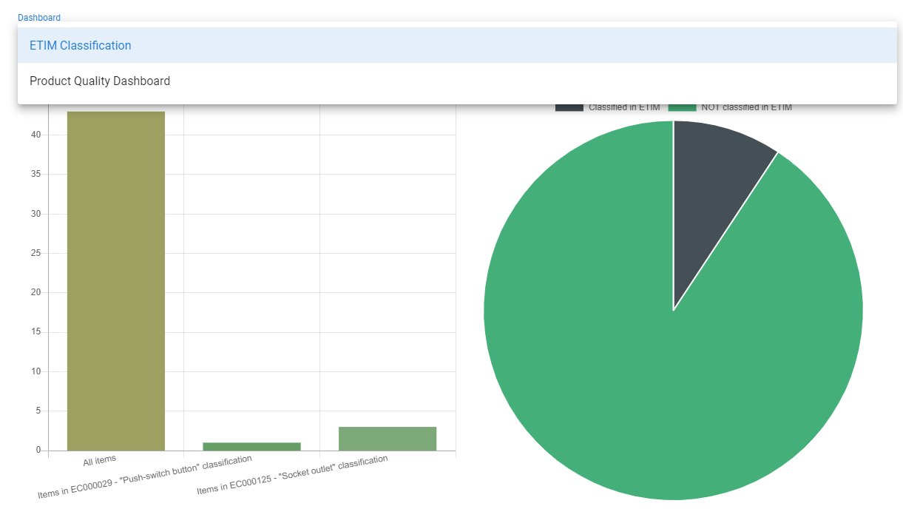
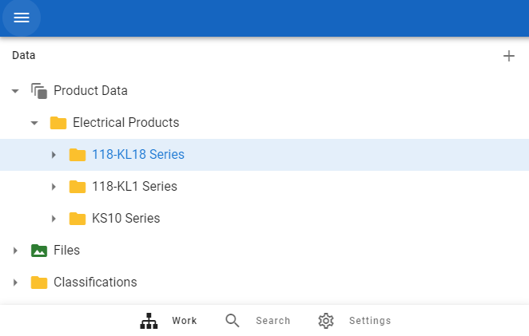
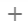
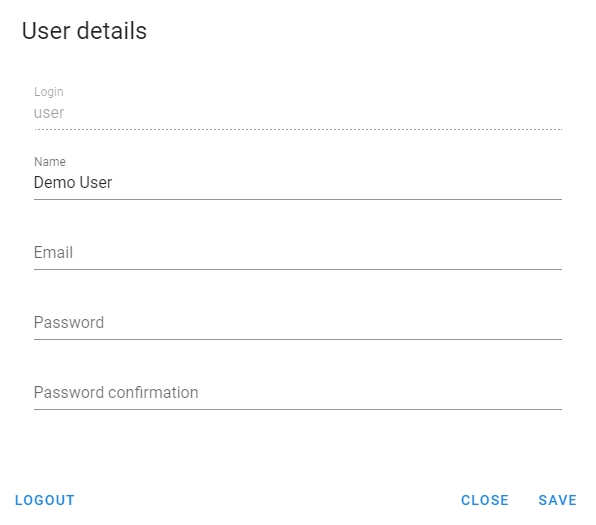

# Home Page

[[toc]]

You will see the following screen after login to system:

 

On the left is the Navigation Tree section, and on the right is the Dashboards section (if dashboards are configured). More information on customizing Dashboards can be found in the 
[Administrator Guide](http://www.openpim.org/docs/admin/guide/05_Dashboards.html)

## Dashboards

Dashboards display a set of graphs that show analytics about the system.

But these charts are also interactive, if you click on any chart you will be redirected to the [Search](./03_Search.md) view where you will see the corresponding selected items.
For example, if you click on the `ETIM classification status` chart in the `Classified in ETIM` section, you will be redirected to a search and see all the items that are now associated with the ETM classification.

 

If you have only one dashboard configured you will see it at the home page. If you have more dashboards you will have ability to choose what dashboard to see:

 

The system will remember your choice, so the next time the selected dashboard will open automatically.

## Navigation Tree

Navigation Tree allows you to select object to see its properties.

  

You can hide or open Navigation Tree by button 

You can add new objects with the help of  button. This button will be available only if you have necessary permissions.

## User Profile

If you press the button  in the top right corner of the screen, you will see detailed information about the current user:

  

where you can set user name, password and email.

