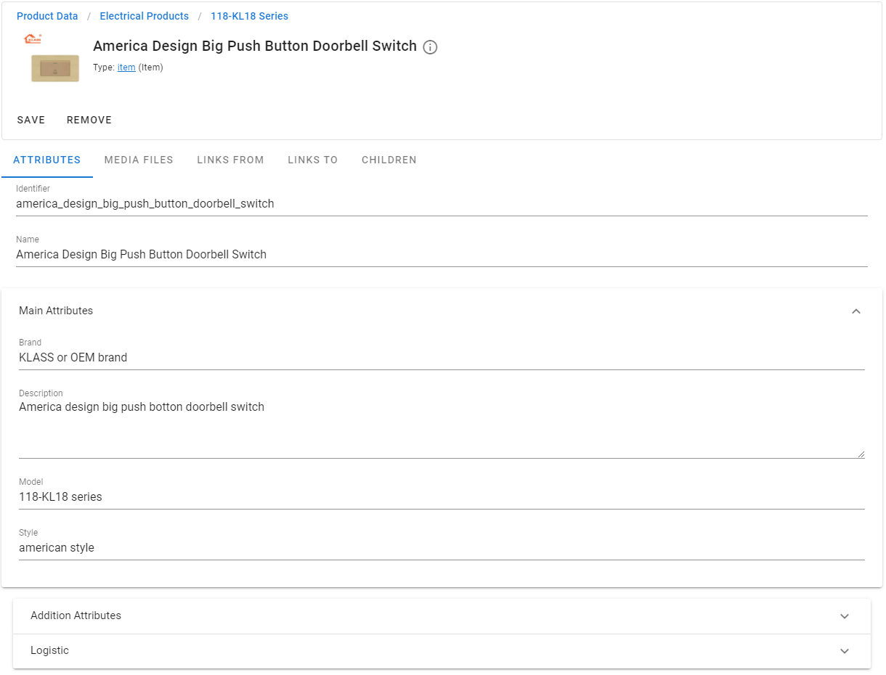
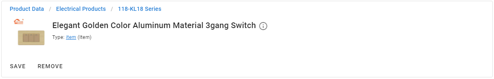
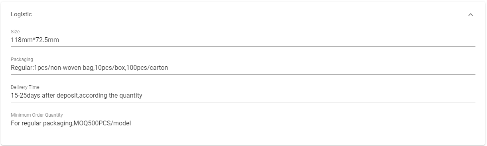
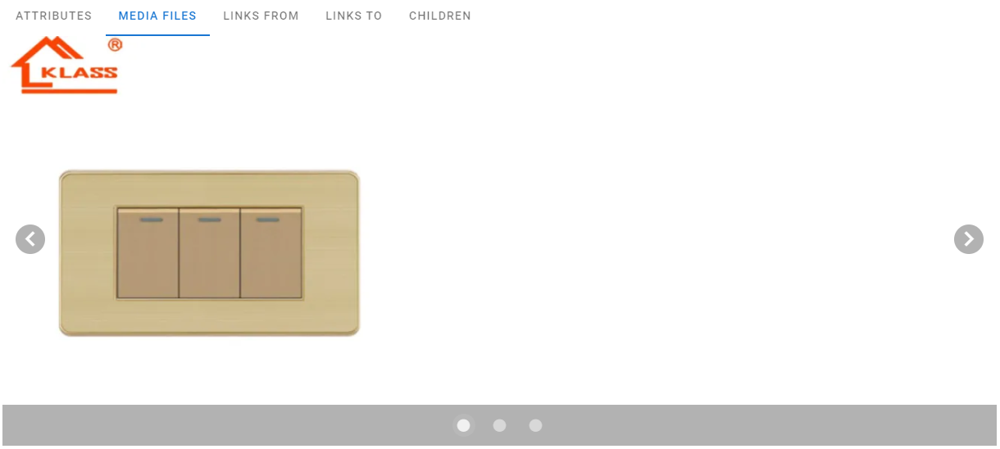
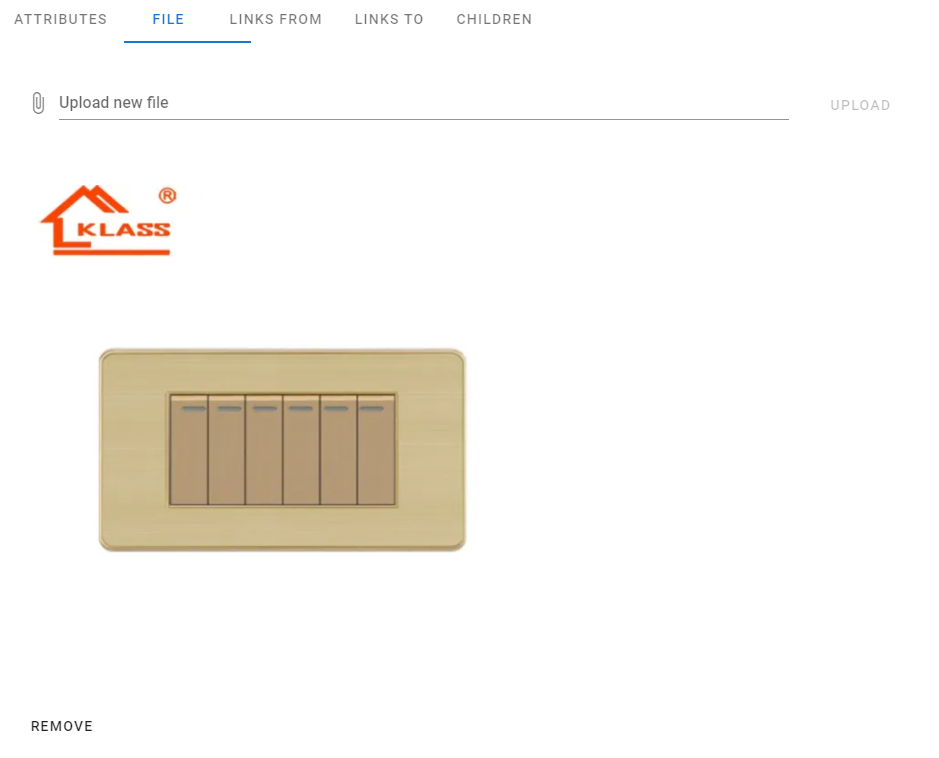
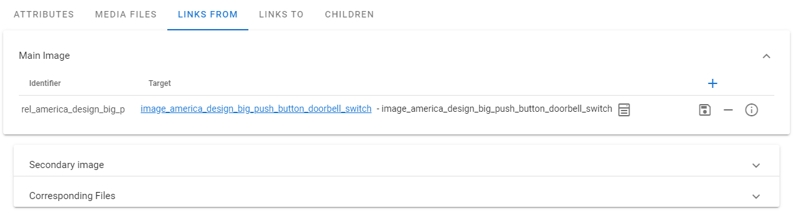
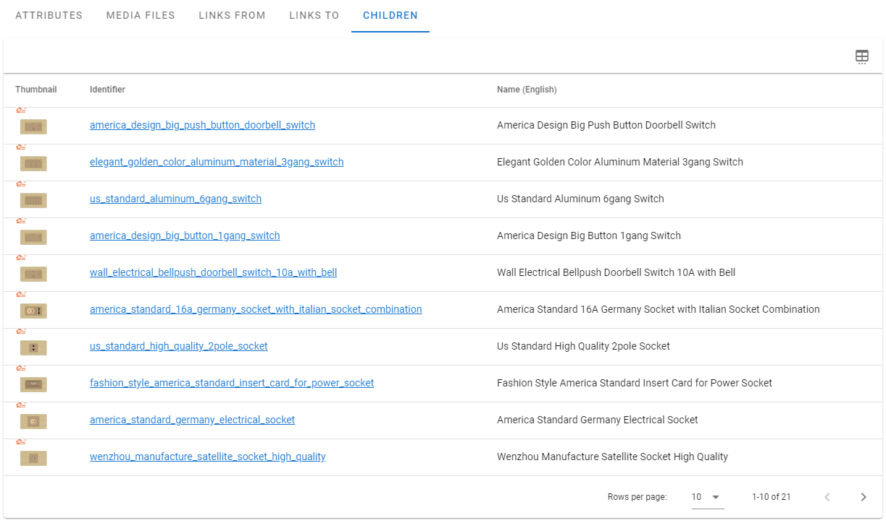
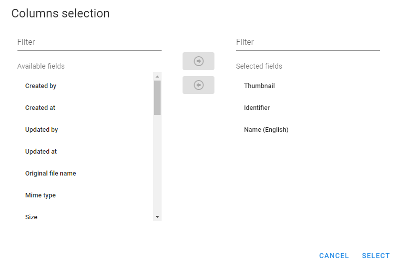

# Products Details

[[toc]]

When you select an item in the navigation tree on the left side of the screen, you will see detailed information about that item on the right:

 

## Item Header

At the top of the screen, you can see the item header section containing the path to the item in the navigation tree, the item name,
a link to the type of this element, the main image of this element (if configured) and buttons for saving or deleting it.

For example:

 

## Attributes

On the top of the attrobutes section you can find item identifier and item name. Identifier is readonly, you can not change it.

Then you can find the attributes of an item grouped by attribute groups. 

For example:

 

Attributes and groups are configuration dependent. Some items may not have any attributes.

You can change the attribute values (if you have corresponding permissions) and click the `Save` button to save the changes.

## Media Files

You can find all media files that are attached to this item at the `Media Files` tab

 

You can navigate through all attached files. Also, you can navigate to the file by clicking on it.

## File Tab

If this element represents a file (this is configured in the system domain model), then you can see the value for the file in the `File` tab:

 

From here you can upload a new file, delete an existing one, or download a file by clicking on it.

## Links

System has 2 tabs with relations to and from this item: `Links From` and `Links To`. Thus, all relationships that have this item as a source are shown in
the `Links From` tab and all relationships that target this item are shown in the `Links To` tab.

 

Each tab has links grouped by relationship type.

You can use  button to add new relation.

## Children

You can see all the corresponding children of this item (if any) in the `Children` tab:

 

Button  allows you to customize which columns you want to see in the grid.

 
