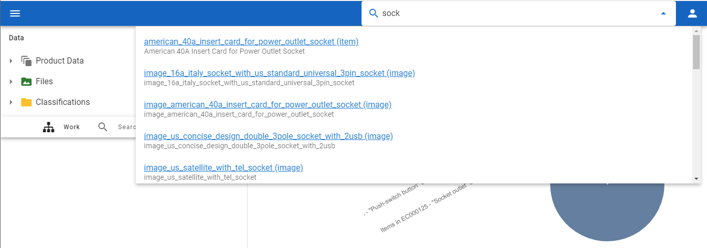
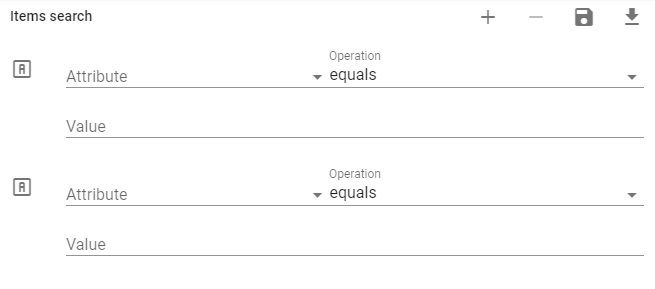
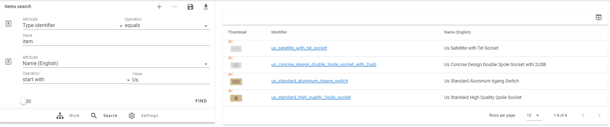
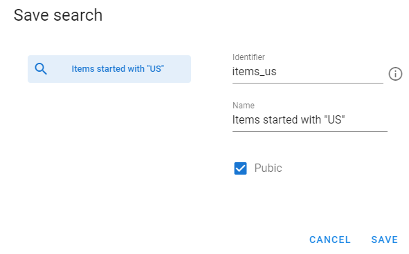
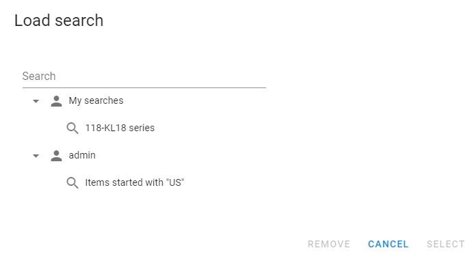
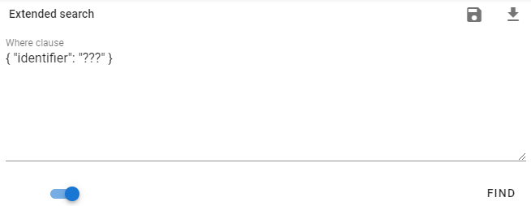

# Search

[[toc]]

## Easy Search

It is easy to find Items by `Identifier` or `Name`. Just start typing text in search box and corresponding items will be shown.

 

## Search by Attributes

If you go to Search view you will see the following screen:

 

Buttons  allows you to add and remove search criterias, for example:

 

Each search criteria have Attribute that you want to use in the search, operation and value. So, you can define search query to use.

For example, here we are looking for object with type `item` that has `Name` starting with "Us":

 

### Saving search

You have ability to save your search criterias to use them later. You should click at  button to save the search:

 

Other users will be able to see your search criterias and use them if you save search as public.

Later you can use  button to load saved search criterias:

 

You will be able to see your own searches and also all public searches of other users.

### Sending search to another user

After you save the search you can copy URL that system has and send it to another user. 
Then this user will be able to open this URL and he will be able to see your search criterias and perform the search (even if your search is not marked as public).

But the user will not be able to see anything if he does not have rights to view this data.

## Extended Search

If you click at  button you will switch the search to extended mode.
	
 

Here you have more abilities then searching by attributes, but you must use special query language. It is described in [Administrator Guide](http://www.openpim.org/docs/admin/guide/06_Appendix.html#query-language).

You also have ability to save and load Extended Search.